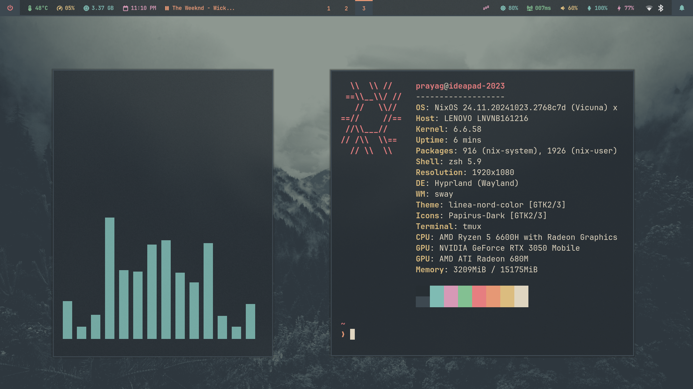
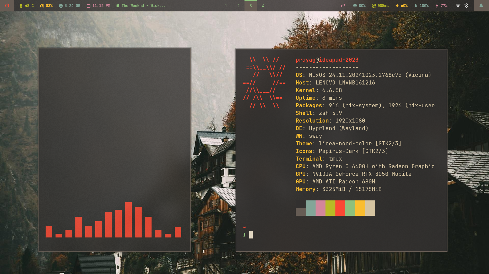
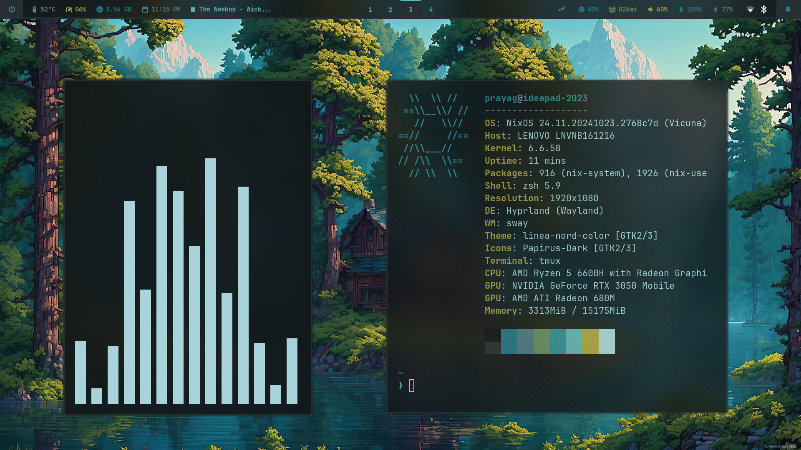

<center>


# NixOS Dotfiles
Highly flexible and easy to manage Nix configuration





</center>

---

## Quick Intro
These are my first NixOS dotfiles. The following is the file tree:
```
nixos
├── common (some configs that I'm sure will be common on all of my setups)
├── devices
│   └── printers
├── flake.lock
├── flake.nix
├── home (home manager files)
│   ├── environments
│   │   └── hyprland
│   │       ├── default.nix
│   │       ├── overlays
│   │       ├── scripts (my scripts related to hyprland)
│   │       ├── software
│   │       │   ├── configs (configs related to hyprland)
│   │       │   ├── global.nix (for system packages, programs or services)
│   │       │   └── local.nix (for home manager packages, programs or services)
│   │       └── wallpaper
│   └── software
│       ├── configs (configs related to software like neovim, tmux, which are independent of the environment)
│       ├── drv (my derivations)
│       ├── global.nix (for system packages, programs or services)
│       └── local.nix (for home manager packages, programs or services)
├── hosts
│   └── ideapad-2023
│       ├── configuration.nix
│       ├── hardware-configuration.nix
│       └── system
│           ├── bluetooth.nix
│           ├── cpu.nix
│           ├── default.nix
│           ├── disks.nix
│           ├── graphics.nix
│           └── tlp.nix
├── overlays
└── users
    └── prayag
        ├── global.nix
        └── local.nix 
```

I created this structure in such a way that you can connect different files like lego bricks. For example, in the `hosts` folder, you can add any number of host devices like laptops or desktop PCs. In the `devices` folder, you can add other devices like printers. In the `home/software` folder, you can add software that you'd like to install. In the `home/environments` folder you can add other window managers or desktop environments. In the `users` folder, you have to specify which of these files to include for a specific user. I'll explain the other parts later...
